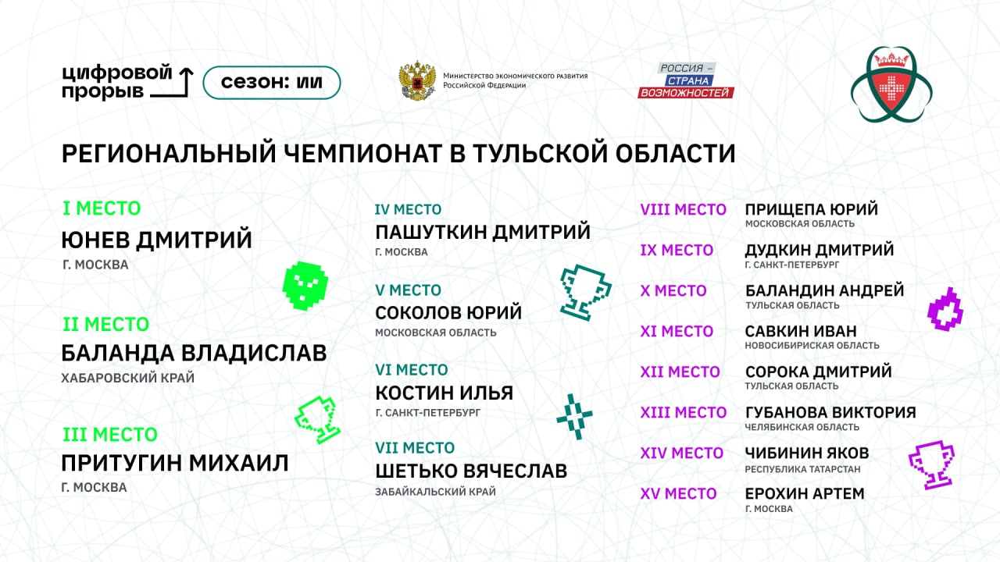

# tul_obl_ai_hack

Решение - использование последнего значения предыдующего месяца * константный множитель увеличения числа пациентов месяц к месяцу.

- cv - 0.926
- public lb - 0.951
- private lb - 0.921601 (15/116)

Данные train сжаты в формат .gz для перемещения в репозиторий. 

